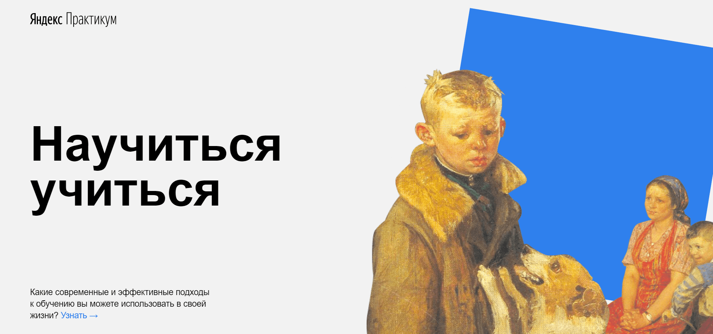

# How to learn

_A single page application with a description of effective approaches to learning._

**Stack:**

- HTML;
- CSS.

**Realization:**

- CSS-animation;
- flex layout;
- media files and external data sources (i.e. iframe to insert a video from Youtube);
- nested BEM-methodology.

**Project status:**

- finished.

[Here is the link to the web site](https://nadineplatonova.github.io/how-to-learn)
